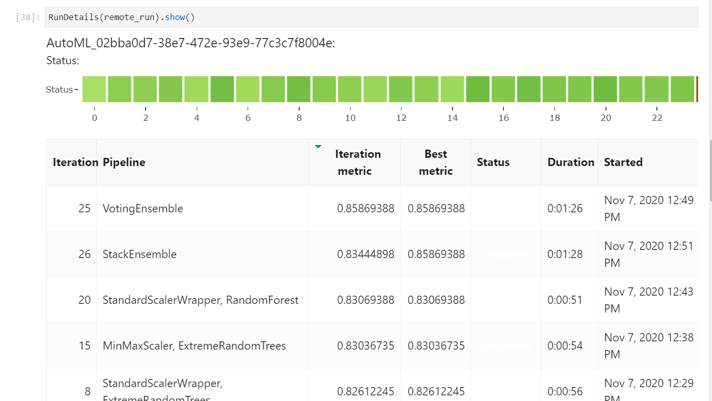
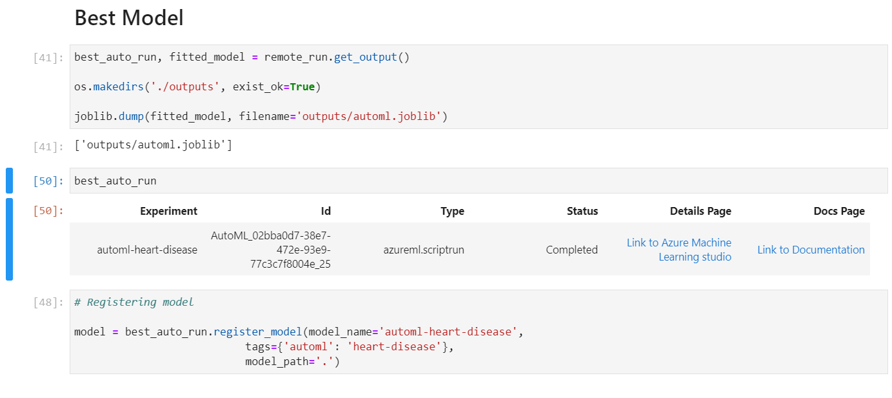
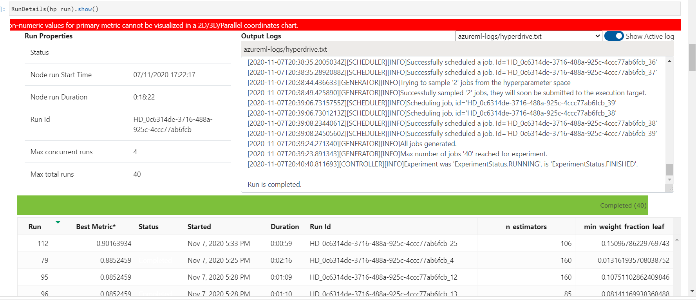
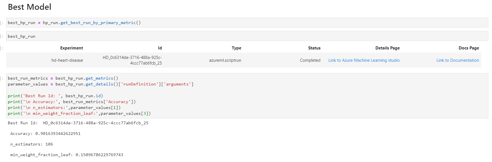
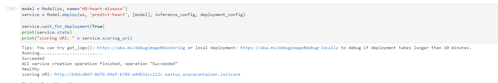

# UCI Heart Prediction

This project intends to train a Classifier for the UCI Heart Disease dataset by using two different approaches with Azure Machine Learning: Automated Machine Learning and a  Hyperparameter Tuned model with HyperDrive.

## Project Set Up and Installation
All of the required libraries come pre-installed on the Azure Machine Learning Compute Instance. In order to reproduce it, simply open up, for example, a `STANDARD_DS3_V2` instance, clone this repo and run the notebook steps. To setup the environment used, simply type

```python

my_env = Environment.load_from_directory("environment_files")

```

## Dataset

### Overview
This dataset takes 13 of the most commonly used features for identifying the presence of a heart disease in a given patient, such as `age`, `sex`, `blood_pressure` and so on. It was taken from the Kaggle repository, with the link informed in the Access section below. 

### Task
This problem will be solved by taking every feature on the dataset and try to *classify* whether a patient has a heart disease (`target = 0`) or not (`target > 0`). Two approaches shall take place, comparing the efforts and results from an Automated Machine Learning to a Hyperparameter-tuned model. Both of them will be created by **not** making any kind of transformation or feature engineering beforehand, simply to compare the efforts and results.

### Access
The dataset can be found by [clicking here](https://www.kaggle.com/ronitf/heart-disease-uci). Once downloaded, open up the Dataset module on the Assets section and register a Dataset from a local file using the name `heart-disease-uci`. If you register it under a different name, you should also change the reading data sections on the `automl.ipynb` and the `train.py` codes. 

## Automated ML
*TODO*: Give an overview of the `automl` settings and configuration you used for this experiment

The following settings were used for the Automated Machine Learning task:

```python

automl_settings = {
    "experiment_timeout_minutes": 30,
    "task": 'classification',
    "enable_early_stopping": True,
    "primary_metric": 'accuracy',
    "label_column_name": 'target',
    "max_cores_per_iteration": -1,
    "n_cross_validations": 5,
}

```

The number of minutes for the experiment timeout and the maximum number of cores (*max.*) were chosen to keep the costs under control while using all of the resources that were available on the computing machine. It was also chosen to enable the early stopping to avoid unnecessary calculations. Although this is a disease-related problem and one might consider to have a different metric for patient safety reasons, accuracy was the goal metric in order to keep the problem simple and investigate how well it would perform.   

### Results

The best performing model that came out of the Automated Machine Learning module was the VotingEnsemble with the Accuracy of `0.85`. When analyzing the other metrics that came along the AutoML, maybe a better approach would have been to use a different target metric, such as ROC-AUC or Recall. Also, it would be a good idea to use this specific model and tune its hyperparameters to verify if it would produce an even better model.

Below we can see that the VotingEnsemble algorithm was the best performing one, along with the following approaches. It is nice to see that the third model on the list shows it tried a `StandardScaler` with a `RandomForest` model, whithout explicitly telling it to do so. 



And the best model - Voting Ensemble - can be dumped to a joblib file and registered onto Azure ML with the following commands



## Hyperparameter Tuning
For the Hyperparameter Tuning section, the [ExtraTreesClassifier](https://scikit-learn.org/stable/modules/generated/sklearn.ensemble.ExtraTreesClassifier.html) algorithm was chosen. In general, tree algorithms are less sensitive to scale and tend to make a good generalization of features without previous treatment. The Extreme trees classifier also handles well by itself the control of over-fitting, by averaging the results from the randomized decision trees (a.k.a. Extreme Trees).

The hyperparameters chosen to be optimized were `n_estimators` and `min_weight_fraction_leaf`. 
The first one stands for the number of trees in the forest - and defaults to `100`. The range varied within a discrete "coice" range from `5` to `200`. 
The second one correspond to the minimum weighted fraction that is applied to a leaf node. It was chosen from a **uniformly** distributed range between `0.0` and `0.5`.

The parameter sampling method chosen to optimize the choice was the Bayesian method, with a total of 40 runs, as suggested by the [Azure ML Documentation](https://docs.microsoft.com/en-us/azure/machine-learning/how-to-tune-hyperparameters).


### Results
The best performing run came out with an accuracy of `0.90`, being the hyperparameters tuned with the follwing values: `n_estimators: 106` and `min_weight_fraction_leaf: 0.1509`. Although this is a significant improvement over what we got with the Automated ML approach, it still can be further improved by perhaps selecting a different metric as the optimization goal. Some feature engineering could also help the model stand out. 

Here we can see how the model was found by successfully searching for the best hyperparameters, with the top metrics found. 



And below we can see which were the parameters that generated the best model



## Model Deployment

The deployment of model was made using the one gotten from the hyperparameter tuning approach. It was chosen to deploy via ACI to have it available not only locally with a better sense on what would be its Production reality. In order to query the results with the Python requests library, the following code shall be written:

```python

import requests
import json

url = service.scoring_uri

testing_data = [[
        62,
        1,
        3,
        145,
        233,
        1,
        0,
        150,
        0,
        2.1,
        0,
        0,
        1
]]


headers = {'Content-type': 'application/json'}

x = requests.post(url, data = json.dumps(testing_data), headers=headers)

print(x.json())

```

Here we can see a screenshot of the service up and running with the *Healthy* status. Since it was chosen to make the deployment with ACI, by passing this URI as the url argument, it was possible to access the model and use it from anywhere.



OBS.: You can check the webservice working on a GIF on the `imgs/` directory

## Screen recording

Finally, there is a screen recording made to better explain the work involved and the working deployed model on Youtube [here](https://youtu.be/ZJwoP8it-O8)
